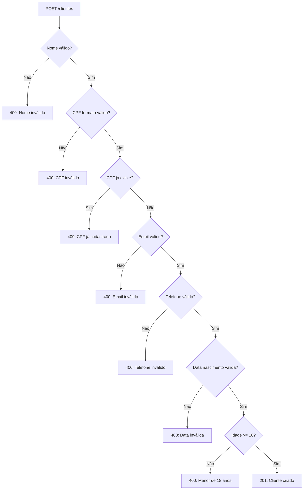

# 📋 API de Clientes - Documentação Completa

## ✅ Funcionalidades Implementadas

### 1. POST /api/clientes - Criar Novo Cliente

#### Descrição:
Cadastra um novo cliente no sistema com validações completas de CPF, idade, email e telefone.

#### Headers:
```http
Authorization: Bearer {token}
Content-Type: application/json
```

#### Body (JSON):
```json
{
  "name": "João Silva",
  "cpf": "12345678900",
  "birth_date": "1990-05-15",
  "email": "joao@email.com",
  "phone": "11999887766"
}
```

#### Campos:

| Campo | Tipo | Obrigatório | Validações |
|-------|------|-------------|------------|
| `name` | `string` | ✅ | Mín: 3 caracteres, Máx: 255 caracteres |
| `cpf` | `string` | ✅ | 11 dígitos, válido (dígitos verificadores), único |
| `birth_date` | `string` | ✅ | Formato YYYY-MM-DD, passado, mínimo 18 anos |
| `email` | `string` | ❌ | Formato de email válido (se fornecido) |
| `phone` | `string` | ❌ | 10-11 dígitos (se fornecido) |

#### Validações Implementadas:

1. **Nome**:
   - ✅ Mínimo 3 caracteres
   - ✅ Máximo 255 caracteres

2. **CPF**:
   - ✅ Deve ter 11 dígitos
   - ✅ Aceita com ou sem formatação (`123.456.789-00` ou `12345678900`)
   - ✅ Valida dígitos verificadores
   - ✅ Rejeita CPFs com todos os dígitos iguais (`111.111.111-11`)
   - ✅ Verifica se já existe no sistema (único)

3. **Data de Nascimento**:
   - ✅ Formato YYYY-MM-DD
   - ✅ Deve ser data passada (não hoje ou futuro)
   - ✅ Cliente deve ter pelo menos 18 anos

4. **Email** (opcional):
   - ✅ Formato de email válido
   - ✅ Se vazio, não valida

5. **Telefone** (opcional):
   - ✅ Aceita com ou sem formatação (`(11) 99988-7766` ou `11999887766`)
   - ✅ Deve ter entre 10 e 11 dígitos
   - ✅ Se vazio, não valida

#### Resposta de Sucesso (201 Created):
```json
{
  "id": 123,
  "client_id": 123,
  "name": "João Silva",
  "cpf": "12345678900",
  "birth_date": "1990-05-15",
  "email": "joao@email.com",
  "phone": "11999887766",
  "strikes": 0,
  "strikes_count": 0,
  "total_reservations": 0,
  "created_at": "2025-11-13T10:30:00.000Z"
}
```

#### Respostas de Erro:

##### 400 Bad Request - Dados inválidos:
```json
{
  "error": "CPF inválido"
}
```

**Possíveis mensagens de erro 400**:
- `"CPF deve ter 11 dígitos"`
- `"CPF inválido"`
- `"formato de email inválido"`
- `"telefone deve ter entre 10 e 11 dígitos"`
- `"formato de data inválido. Use YYYY-MM-DD"`
- `"data de nascimento deve ser uma data passada"`
- `"cliente deve ter pelo menos 18 anos"`

##### 409 Conflict - CPF já cadastrado:
```json
{
  "error": "CPF já cadastrado no sistema"
}
```

ou

```json
{
  "error": "Telefone já cadastrado"
}
```

---

### 2. GET /api/clientes/cpf/:cpf - Buscar Cliente por CPF

#### Descrição:
Busca um cliente existente pelo número do CPF.

#### Headers:
```http
Authorization: Bearer {token}
```

#### Parâmetros:
- **cpf**: String com 11 dígitos (com ou sem formatação)

#### Exemplos de URL válidas:
```
GET /api/clientes/cpf/12345678900
GET /api/clientes/cpf/123.456.789-00  (também funciona)
```

#### Resposta de Sucesso (200 OK):
```json
{
  "id": 123,
  "client_id": 123,
  "name": "João Silva",
  "cpf": "12345678900",
  "birth_date": "1990-05-15",
  "email": "joao@email.com",
  "phone": "11999887766",
  "strikes": 0,
  "strikes_count": 0,
  "total_reservations": 15,
  "created_at": "2025-01-01T10:00:00.000Z"
}
```

#### Resposta de Erro (404 Not Found):
```json
{
  "error": "Cliente não encontrado"
}
```

---

## 🔍 Fluxo de Validação



---

## 📝 Exemplos de Uso

### Exemplo 1: Criar Cliente Válido

```javascript
const response = await api.post('/clientes', {
  name: "João Silva",
  cpf: "12345678900",          // Aceita com ou sem formatação
  birth_date: "1990-05-15",    // YYYY-MM-DD
  email: "joao@email.com",
  phone: "11999887766"
});

// Response: 201 Created
console.log(response.data.id); // 123
```

### Exemplo 2: Buscar Cliente por CPF

```javascript
// Aceita com ou sem formatação
const response = await api.get('/clientes/cpf/12345678900');

// Response: 200 OK
console.log(response.data.name); // "João Silva"
console.log(response.data.total_reservations); // 15
```

### Exemplo 3: Tratamento de Erros

```javascript
try {
  await api.post('/clientes', {
    name: "Maria",
    cpf: "11111111111",        // CPF inválido (todos dígitos iguais)
    birth_date: "2010-01-01",  // Menor de 18 anos
    email: "invalido",         // Email sem @
    phone: "119"               // Telefone muito curto
  });
} catch (error) {
  console.log(error.response.status);  // 400
  console.log(error.response.data.error); // "CPF inválido"
}
```

---

## 🧪 Testes Implementados

### Testes de Validação (`tests/utils/validate_test.go`):

✅ **TestValidateCPF**:
- CPF válido: `11144477735`
- CPF válido com formatação: `111.444.777-35`
- CPF inválido (todos iguais): `00000000000`
- CPF inválido (dígitos verificadores): `12345678901`
- CPF com tamanho errado

✅ **TestValidateEmail**:
- Email vazio (opcional)
- Email válido: `joao@example.com`
- Email inválido sem @
- Email inválido sem domínio

✅ **TestValidatePhoneNumber**:
- Telefone vazio (opcional)
- Telefone válido com 11 dígitos
- Telefone válido com 10 dígitos
- Telefone formatado: `(11) 99988-7766`
- Telefone muito curto/longo

✅ **TestValidateMinimumAge**:
- 20 anos (válido)
- 18 anos e 1 dia (válido)
- 17 anos (inválido)
- 10 anos (inválido)

---

## 🔧 Funções Utilitárias

### utils/normalize.go

#### ValidateCPF(cpf string) error
Valida CPF completo (formato e dígitos verificadores).

```go
err := utils.ValidateCPF("111.444.777-35")
// err == nil (válido)

err := utils.ValidateCPF("11111111111")
// err != nil (inválido - todos dígitos iguais)
```

#### ValidateEmail(email string) error
Valida formato de email.

```go
err := utils.ValidateEmail("joao@example.com")
// err == nil (válido)

err := utils.ValidateEmail("invalido")
// err != nil (sem @)
```

#### ValidatePhoneNumber(phone string) error
Valida telefone (10-11 dígitos).

```go
err := utils.ValidatePhoneNumber("11999887766")
// err == nil (válido)

err := utils.ValidatePhoneNumber("119")
// err != nil (muito curto)
```

#### ValidateMinimumAge(birthDate time.Time, minimumAge int) error
Valida idade mínima.

```go
birthDate := time.Date(2000, 1, 1, 0, 0, 0, 0, time.Local)
err := utils.ValidateMinimumAge(birthDate, 18)
// err == nil (25 anos)

birthDate := time.Date(2010, 1, 1, 0, 0, 0, 0, time.Local)
err := utils.ValidateMinimumAge(birthDate, 18)
// err != nil (15 anos)
```

---

## 📊 Campos no DTO de Saída

O `ClienteOutputDTO` inclui campos para compatibilidade:

| Campo | Tipo | Descrição |
|-------|------|-----------|
| `id` | `uint` | ID do cliente |
| `client_id` | `uint` | Alias de `id` (compatibilidade) |
| `name` | `string` | Nome do cliente |
| `cpf` | `string` | CPF normalizado (apenas números) |
| `birth_date` | `string` | Data nascimento (YYYY-MM-DD) |
| `email` | `string` | Email |
| `phone` | `string` | Telefone normalizado (apenas números) |
| `strikes` | `int` | Quantidade de advertências |
| `strikes_count` | `int` | Alias de `strikes` (compatibilidade) |
| `total_reservations` | `int` | Total de reservas do cliente |
| `created_at` | `time.Time` | Data de criação do cadastro |

---

## ⚠️ Notas Importantes

1. **Normalização Automática**:
   - CPF e telefone são armazenados sem formatação
   - Frontend pode formatar para exibição
   - API aceita ambos os formatos

2. **Compatibilidade**:
   - `id` e `client_id` retornam o mesmo valor
   - `strikes` e `strikes_count` retornam o mesmo valor
   - Garante compatibilidade com frontend

3. **Campos Opcionais**:
   - `email` e `phone` são opcionais
   - Se vazios, não são validados
   - Se fornecidos, devem ser válidos

4. **Idade Mínima**:
   - Cliente deve ter **18 anos completos**
   - Cálculo considera ano, mês e dia
   - Se fez 18 anos hoje, é válido

5. **CPF Único**:
   - Sistema não permite CPF duplicado
   - Retorna 409 Conflict se já existir

---

## 🚀 Status da Implementação

- ✅ Campo `birth_date` adicionado ao modelo
- ✅ Validação completa de CPF (dígitos verificadores)
- ✅ Validação de idade mínima (18 anos)
- ✅ Validação de email e telefone
- ✅ Endpoints GET e POST implementados
- ✅ Testes unitários de validação
- ✅ Documentação completa
- ✅ Status codes apropriados (400, 409, 201, 200)

---

**Versão**: 2.0.0  
**Data**: 13/11/2025  
**Status**: ✅ Completo e Testado

