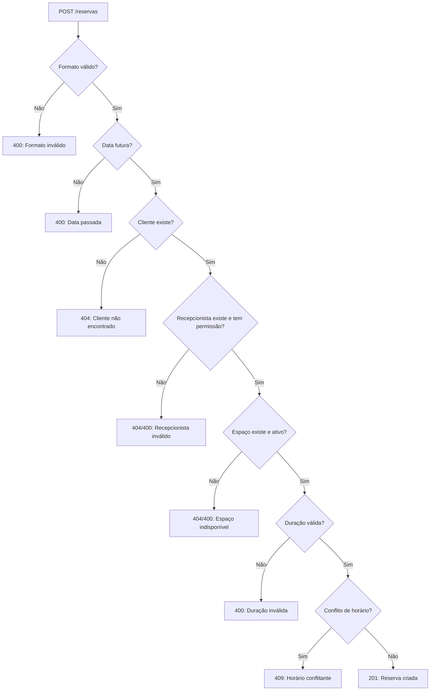

# 📅 API de Reservas

## Endpoint: `POST /api/reservas`

### Descrição:
Cria uma nova reserva de espaço com validações completas de formato, disponibilidade e conflitos.

---

## Headers:
```
Authorization: Bearer {token}
Content-Type: application/json
```

---

## Body (JSON):

```json
{
  "client_id": 1,
  "receptionist_id": 10,
  "space_id": 2,
  "date": "2025-11-13",
  "start_time": "16:00:00",
  "duration_hours": 1
}
```

---

## Campos do Body:

| Campo | Tipo | Obrigatório | Descrição | Validações |
|-------|------|-------------|-----------|------------|
| `client_id` | `number` | ✅ | ID do cliente | Deve existir no sistema |
| `receptionist_id` | `number` | ✅ | ID do recepcionista | Deve existir e ter role adequada |
| `space_id` | `number` | ✅ | ID do espaço | Deve existir e estar ativo |
| `date` | `string` | ✅ | Data da reserva | Formato: `YYYY-MM-DD`, não pode ser passada |
| `start_time` | `string` | ✅ | Hora de início | Formato: `HH:MM` ou `HH:MM:SS` |
| `duration_hours` | `number` | ✅ | Duração em horas | Entre 1 e 24 horas |

---

## Formatos Aceitos:

### ✅ start_time:
- `"16:00"` → Convertido para `"16:00:00"`
- `"16:00:00"` → Mantido como está

### ❌ start_time (inválidos):
- `"16"` (apenas hora)
- `"4:00 PM"` (formato 12h)
- `"16:00:00:00"` (com segundos extras)

### ✅ date:
- `"2025-11-13"` (ISO 8601)

### ❌ date (inválidos):
- `"13/11/2025"` (formato brasileiro)
- `"11-13-2025"` (formato americano)
- `"2025/11/13"` (barras)

---

## Validações Realizadas:

### 1. **Formato de Data e Hora**
- Data deve estar no formato `YYYY-MM-DD`
- Hora deve estar no formato `HH:MM` ou `HH:MM:SS`

### 2. **Data Futura**
- A data não pode ser no passado
- Data de hoje é aceita

### 3. **Cliente Existe**
- O `client_id` deve corresponder a um cliente cadastrado
- Retorna `404` se não encontrado

### 4. **Recepcionista Válido**
- O `receptionist_id` deve corresponder a um usuário cadastrado
- Usuário deve ter role `admin`, `recepcionista` ou `locacao`
- Retorna `404` se não encontrado
- Retorna `400` se não tiver permissão

### 5. **Espaço Disponível**
- O `space_id` deve corresponder a um espaço cadastrado
- Espaço deve ter status `"ativo"`
- Retorna `404` se não encontrado
- Retorna `400` se status não for `"ativo"`

### 6. **Duração Válida**
- Deve ser entre 1 e 24 horas
- Retorna `400` se fora do range

### 7. **Conflito de Horários**
- Verifica se já existe reserva no mesmo espaço que sobreponha o horário
- Retorna `409 Conflict` se houver sobreposição

---

## Respostas:

### ✅ Sucesso (201 Created):

```json
{
  "id": 123,
  "client_name": "João Silva",
  "receptionist_name": "Maria Santos",
  "space_name": "Sala de Reunião A",
  "date": "13/11/2025",
  "start_time": "16:00",
  "end_time": "17:00",
  "duration_hours": 1
}
```

### ❌ Erro 400 (Bad Request):

**Formato inválido:**
```json
{
  "error": "formato de data inválido. Use YYYY-MM-DD"
}
```

**Data passada:**
```json
{
  "error": "a data não pode ser no passado"
}
```

**Espaço indisponível:**
```json
{
  "error": "espaço não está disponível para reservas"
}
```

**Duração inválida:**
```json
{
  "error": "duração deve ser entre 1 e 24 horas"
}
```

**Sem permissão:**
```json
{
  "error": "usuário não tem permissão para criar reservas"
}
```

### ❌ Erro 404 (Not Found):

```json
{
  "error": "cliente não encontrado"
}
```

ou

```json
{
  "error": "recepcionista não encontrado"
}
```

ou

```json
{
  "error": "espaço não encontrado"
}
```

### ❌ Erro 409 (Conflict):

```json
{
  "error": "espaço já reservado para este horário"
}
```

### ❌ Erro 500 (Internal Server Error):

```json
{
  "error": "Erro ao criar reserva",
  "details": "Mensagem técnica do erro"
}
```

---

## Status Codes:

| Code | Descrição |
|------|-----------|
| `201` | Reserva criada com sucesso |
| `400` | Dados inválidos, formato incorreto ou validação falhou |
| `401` | Não autenticado (token inválido) |
| `404` | Cliente, recepcionista ou espaço não encontrado |
| `409` | Conflito de horário |
| `500` | Erro interno do servidor |

---

## Exemplos de Uso:

### Exemplo 1: Reserva com HH:MM

```javascript
const response = await api.post('/reservas', {
  client_id: 1,
  receptionist_id: 10,
  space_id: 2,
  date: "2025-11-13",
  start_time: "16:00",
  duration_hours: 2
});
```

### Exemplo 2: Reserva com HH:MM:SS

```javascript
const response = await api.post('/reservas', {
  client_id: 1,
  receptionist_id: 10,
  space_id: 2,
  date: "2025-11-13",
  start_time: "16:00:00",
  duration_hours: 1
});
```

---

## Testes Implementados:

### ✅ Testes de Formato:
- Aceita `HH:MM` e converte para `HH:MM:SS`
- Aceita `HH:MM:SS` mantendo o formato
- Rejeita formatos inválidos de hora
- Aceita `YYYY-MM-DD` para data
- Rejeita formatos brasileiros e americanos

### ✅ Testes de Validação:
- Rejeita data no passado
- Rejeita cliente inexistente
- Rejeita recepcionista inexistente
- Rejeita espaço inexistente
- Rejeita espaço em manutenção
- Rejeita duração inválida

### ✅ Testes de Conflito:
- Detecta sobreposição de horários
- Permite reservas adjacentes sem conflito

---

## Notas Importantes:

1. **Timezone**: 
   - ✅ O sistema usa o **timezone local do servidor** (não UTC)
   - Se você enviar `"16:00"`, a reserva será criada para 16:00 no horário local
   - Exemplo: No Brasil (UTC-3), `"16:00"` = 16:00 horário de Brasília
2. **Normalização**: Formatos de hora são normalizados internamente
3. **Atomicidade**: Todas as validações ocorrem antes da criação
4. **Performance**: Conflitos são verificados em uma única query
5. **Roles aceitas**: `admin`, `recepcionista`, `locacao`

---

## Fluxo de Validação:



---

## Implementação Técnica:

### Camadas Envolvidas:

1. **DTO (`dto/reservation_dto.go`)**:
   - `CreateReservationInputDTO`: Aceita strings
   - `CreateReservationDTO`: Usa `time.Time` internamente

2. **Utils (`utils/normalize.go`)**:
   - `NormalizeTime()`: Normaliza formato de hora
   - `ParseDate()`: Parseia data YYYY-MM-DD
   - `ParseDateTime()`: Combina data e hora
   - `ValidateFutureDate()`: Valida data futura

3. **Service (`services/reservation_services.go`)**:
   - `CreateReservationFromInput()`: Validações e conversões
   - `CreateReservation()`: Criação no banco

4. **Handler (`handlers/reservation_handlers.go`)**:
   - `CreateReservationHandler()`: Recebe requisição, chama service, retorna resposta apropriada

---

## Melhorias Futuras:

- [ ] Validar strikes do cliente antes de permitir reserva
- [ ] Adicionar horário de funcionamento do espaço
- [ ] Implementar reservas recorrentes
- [ ] Adicionar sistema de prioridade
- [ ] Notificações de confirmação

